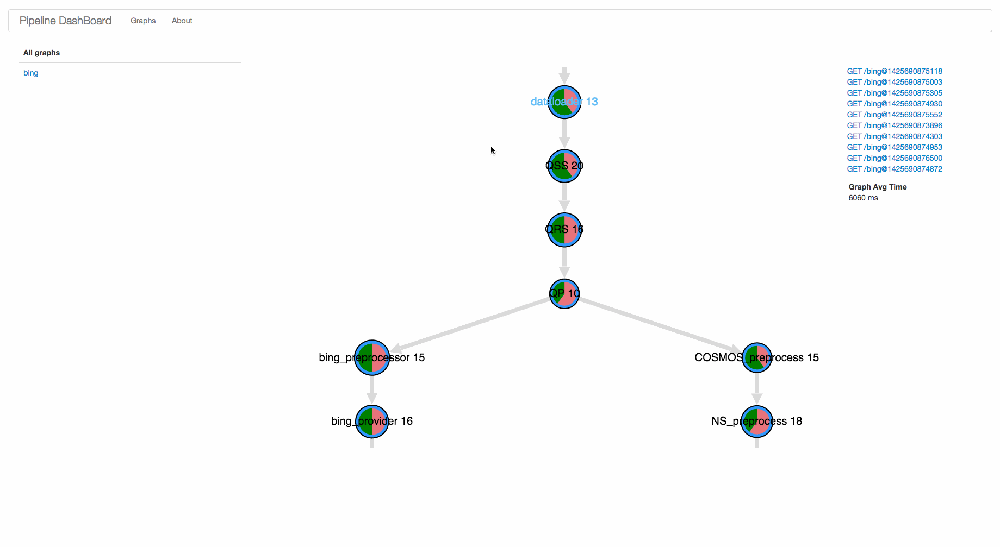

Intro
=====

This tool visualizes pipeline graphs, it can be used to monitor pipeline health, and generate new pipeline graphs right from web GUI, which will make monitoring, tuning, debugging and changing pipeline dependency graphs much easier.


Usage
=====

1. config route in app to use DashboardServlet to route traffic to dashboard servlet, for details about routes see 4. below, example:
```xml
    <servlet>
        <servlet-name>dashboard</servlet-name>
        <servlet-class>com.yahoo.pipeline.dashboard.http.DashboardServlet</servlet-class> 
    </servlet>
    <servlet-mapping>
        <servlet-name>dashboard</servlet-name>
        <url-pattern>/dashboard</url-pattern>
    </servlet-mapping>
```

2. hit `<yourappAddress>/dashboard`, it will list all graphs loaded. Click on graph name, you will get visualization graph with real-time QPS info.

3. APIs:

/dashboard                serve index.html page

/dashboard?q=allgids      return all gids

/dashborad?q=graph&gid=<x>  return data of graph "x"


Features
========
* [x] real-time QPS data for each pipeline task;
* [x] aggregate for each graph, easy to analysis load for each dependency graph;
* [x] implement graph virtualization, with features:
* [x] auto layout graph, source of graph (a.k.a roots) in first row, with highlighted name.
* [x] interactive: drag nodes, drap canvas, zoom in/out
* [x] pie chart inside each node indicates task state distribution (Done, Error, Canceled, others)
* [x] clicking on nodes will display incoming and out going data flow
* [X] display avg time spent for the whole graph
* [x] display avg time spent for each task
* [ ] enable user to edit graph on the fly, and persist changed grah to some configuration format that can be read by pipeline.
* [x] be able to serve history calls and render actual graph executed, with info about errors, state, logs, outputs


Walkthrough of current supported user stories:




Backlog
=======
* [ ] add support for editing and persisting graphs
* [ ] intergrate DashBoard into IDEs to make it even closer to development workflow
* [ ] [bold] auto optimize dependency graph for user
